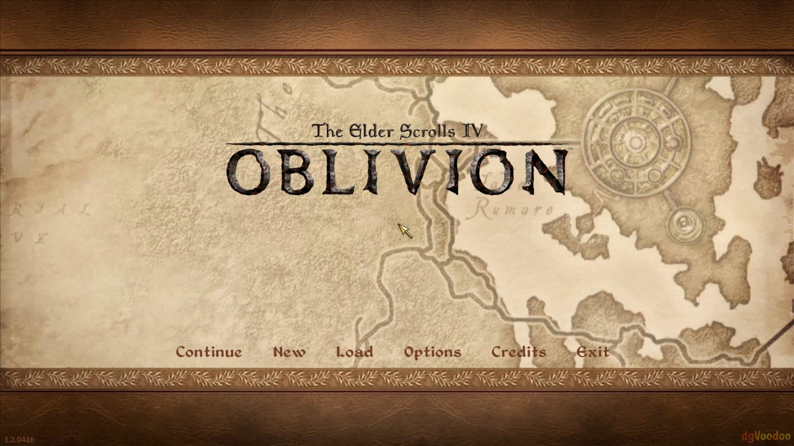
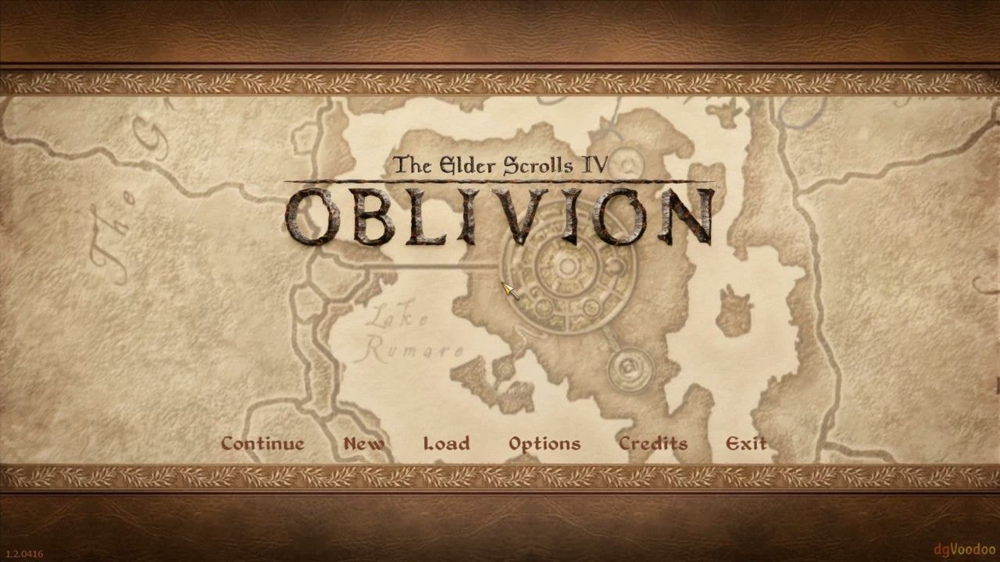

# Validation evidence

The following controlled pair was captured on 2026-09-18 on the author's
Oblivion installation.

| State | Configuration | Result |
|---|---|---|
| OFF | `enabled=0` | Feeder log explicitly reports no frames fed, no runtime queried, no textures created and no Vulkan interop hook installed. |
| ON | `enabled=1` | `NR_ACTIVE`: feed delivery, host evaluation, GPU timing and standalone DFC neural evidence were all present. |

Both screenshots show the Oblivion menu without a black/corrupt frame. They are
separate clean launches; the animated map background means raw pixel subtraction
is not a valid image-quality oracle. This pair does not prove motion quality,
same-process toggling, lifecycle recovery or the complete A01-A12 gate.

